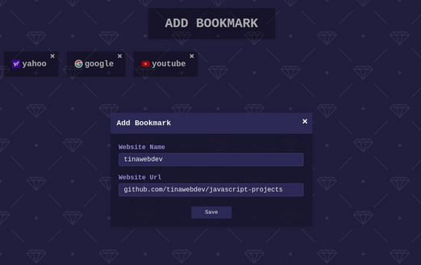

# Bookmark App
Simple application for bookmarking webistes built with pure JavaScript. It uses localStorage for storing bookmarks.

## Demo
You can view a live version [here](https://tinawebdev.github.io/javascript-projects/bookmark-app/).

## Tools
* Icons from [Fontawesome](https://fontawesome.com/)
* Background was made using [Hero Patterns](https://www.heropatterns.com/)
