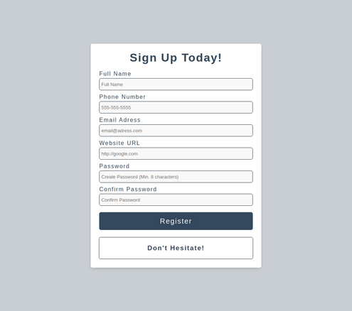
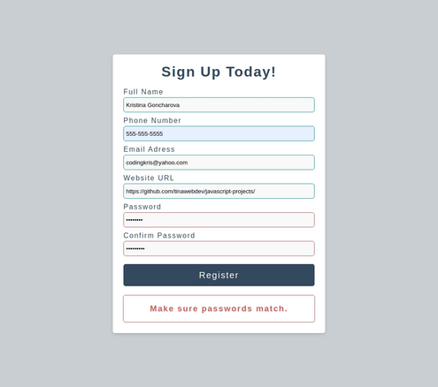
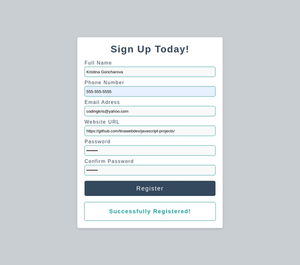

# Form Validation
Simple Form Validation for signing up the user.

#### The validation checks the following:
- Minimum length of username
- Email is in correct format
- Minimum length of password
- Website is of correct format
- Password and Confirm password match
- No field remains empty

## Demo
You can view a live version [here](https://tinawebdev.github.io/javascript-projects/form-validation/).

  
  
  

