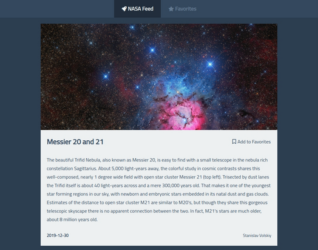

# NASA API Pictures
A web application that displays random NASA Astronomy Pictures of the Day.

## Demo
You can view a live version [here](https://tinawebdev.github.io/javascript-projects/nasa-api-pictures/).

## Tools
* [NASA Open APIs](https://api.nasa.gov/)
* Icons from [Font Awesome](https://fontawesome.com/icons)
* Fonts from [Google Fonts](https://fonts.google.com/)
